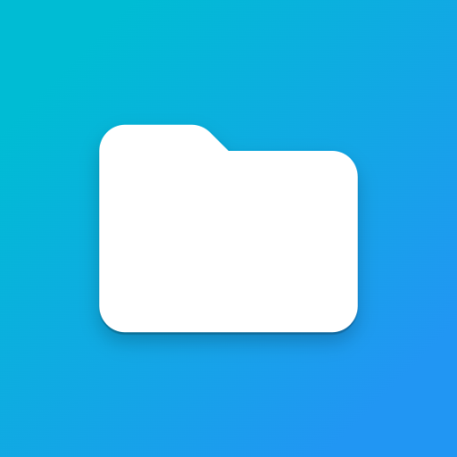

#  &nbsp;Android Resources

Useful Android applications and utilities for development and productivity.

---

## 📱 Available Resources

&nbsp;
&nbsp;<b>Termux</b>

&nbsp; 🟢 Official &nbsp;⭐ Recommended

 
 

A powerful terminal emulator for Android that provides a Linux environment with package management, SSH, Git, Python, and hundreds of command-line utilities.

### Downloads

| Resource | Get | Size |
| :--- | :---: | ---: |
| **Termux** |  | ≈ 💾 102 MB |
| **Termux API** |  | ≈ 💾 2.7 MB |
| **Termux Styling** |  | ≈ 💾 31 MB |

### Notes

- Install **Termux** before installing any plugins.
- The **API** and **Styling** plugins are optional.
- The F-Droid release is recommended over the Google Play version since it receives updates and has full functionality.

---

&nbsp;
&nbsp;<b>Files for Android</b>

 &nbsp; 🟢 Official &nbsp;⭐ Recommended

 
 

A lightweight file manager that restores Android's built-in file management interface, making it easy to browse, organize, move, and manage files.

### Downloads

| Resource | Get | Size |
| :--- | :---: | ---: |
| **Files for Android** |  | ≈ 💾 42 KB |
### Notes

Useful when another file manager cannot access certain Android directories or when you prefer a simple, lightweight file management experience.

---

## 🔗 Other Quick Links

-  **[Virtual Machines](../virtual-machines/)**
- ⬅️ **[Back to ResourceForge](../)**
