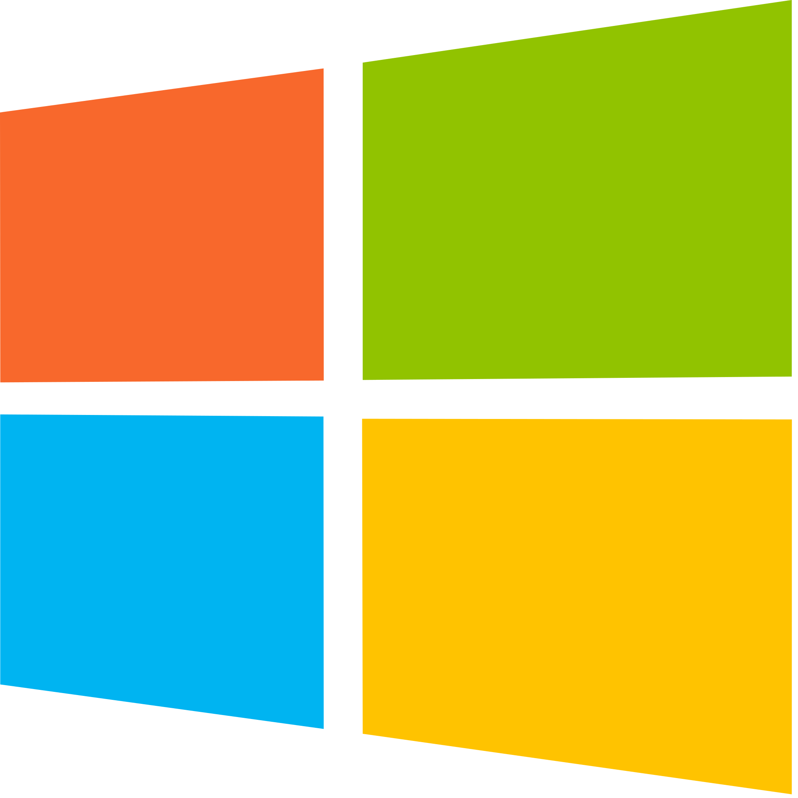
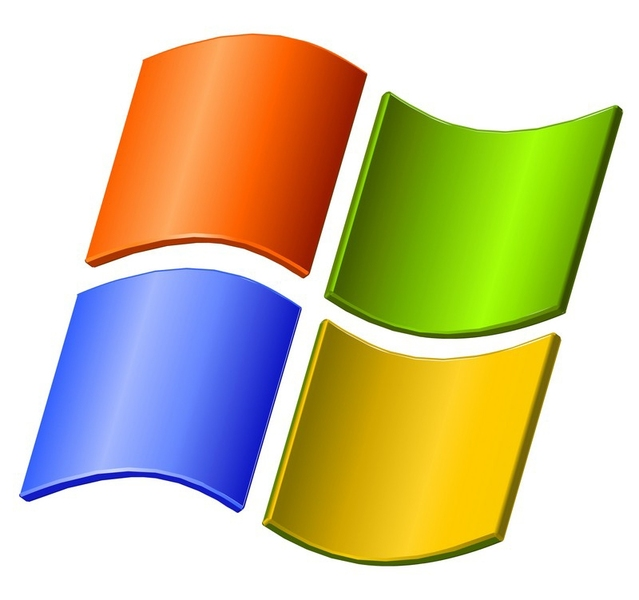
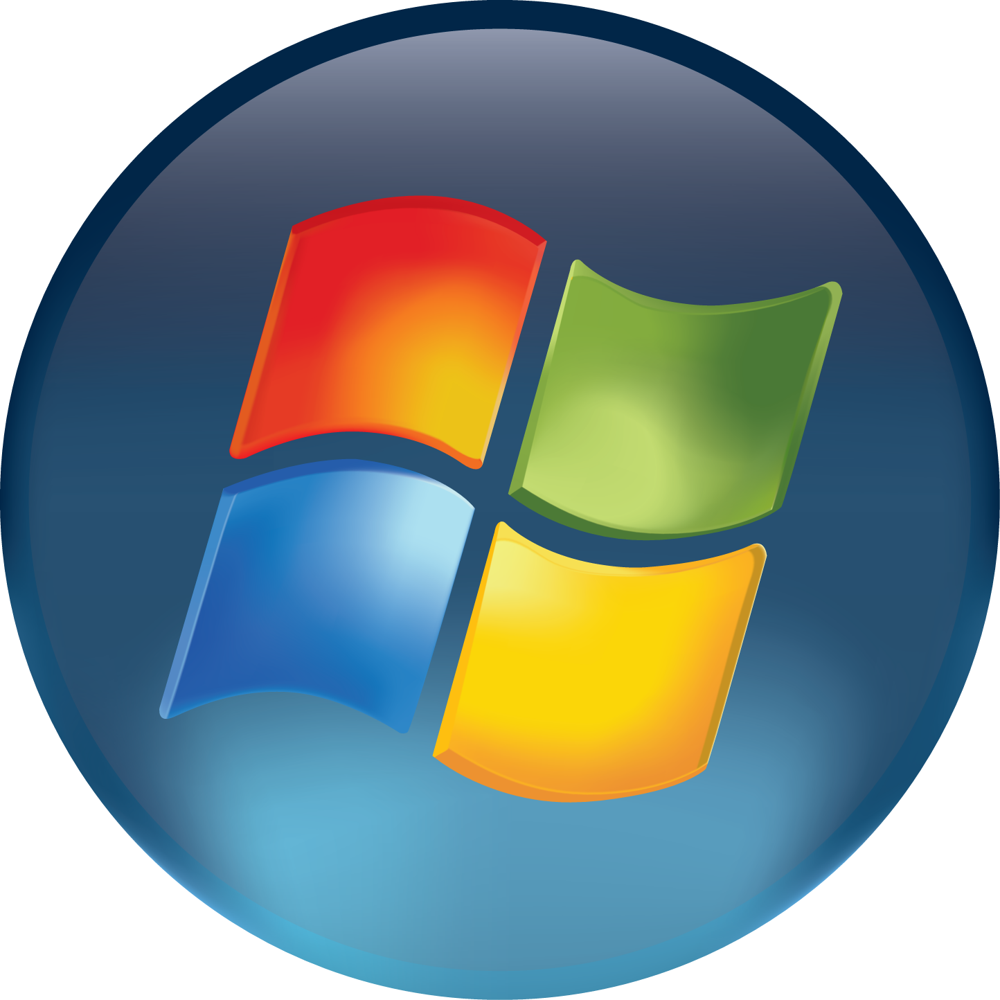
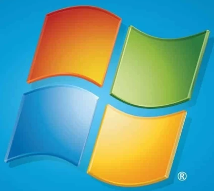
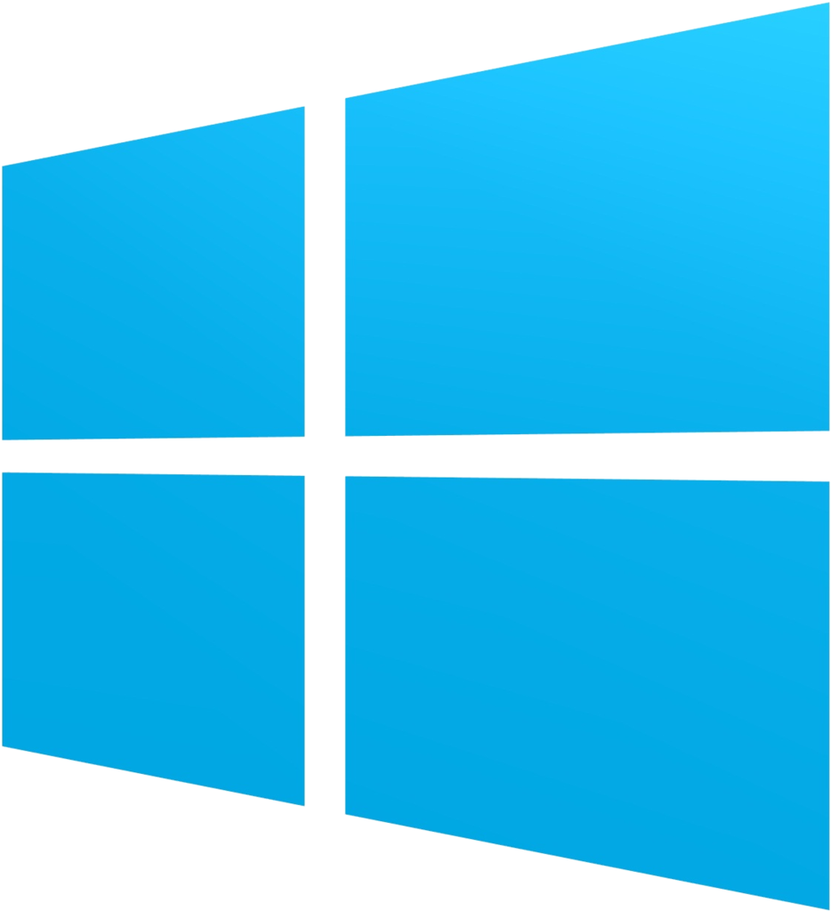
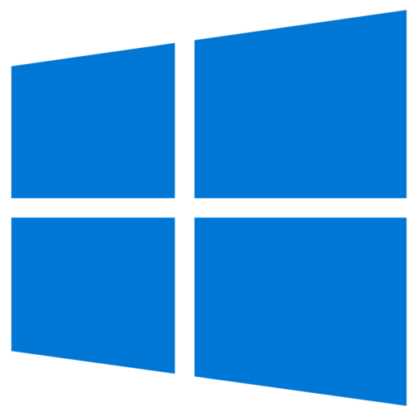
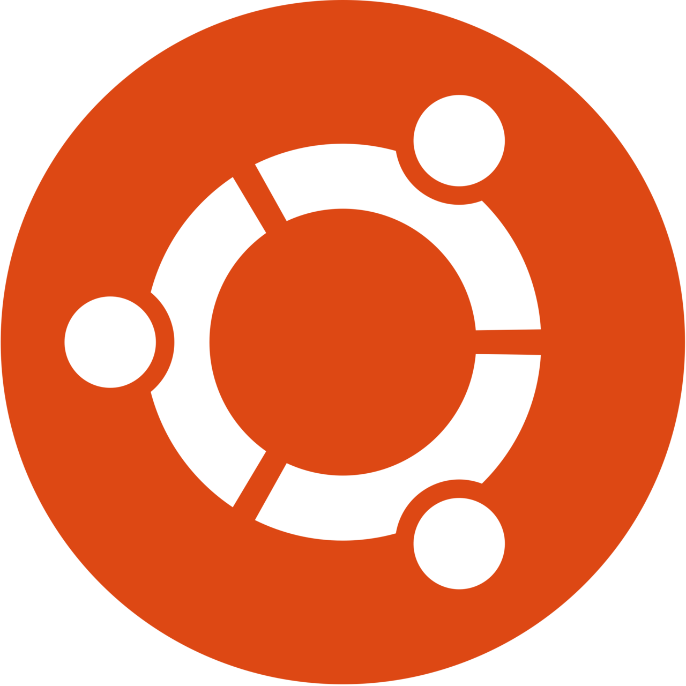
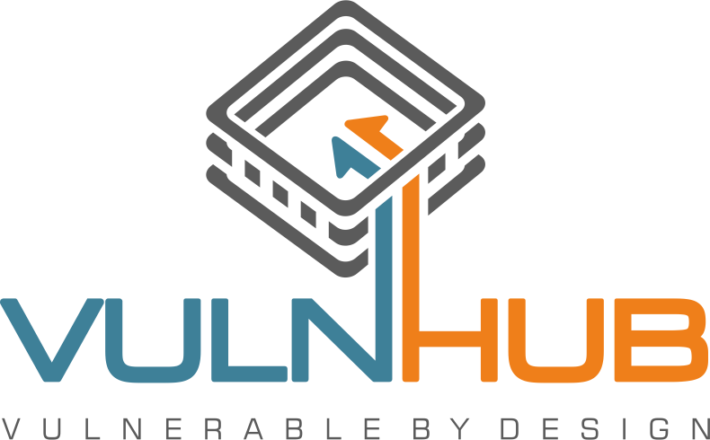

# <span style="vertical-align: middle;"></span>  Virtual Machines

A curated collection of **pre-configured VirtualBox virtual machines** for learning, development, cybersecurity, and testing.

---

## 📖 About

This collection contains ready-to-use virtual machines that have been personally configured and packaged for VirtualBox. They are intended to save setup time by providing environments that can be imported and used immediately.

All virtual machines are compressed as **7z archives** and are intended for educational, research, testing, and personal use.

---

## ⚙️ Prerequisites

Before importing any virtual machine, ensure the following:

- 📖 **[Enable Virtualization](enable-virtualization.md)** in your system BIOS/UEFI.
- 💻 Install **[Oracle VirtualBox](https://www.virtualbox.org/wiki/Downloads)**.
- 💾 Ensure sufficient disk space to extract the downloaded archive.
- 📦 Install **[7-Zip](https://www.7-zip.org/download.html)** to extract `.7z` files.

> **Note**
>
> If VirtualBox fails to launch or reports missing runtime components, install the latest Install the latest **[Microsoft Visual C++ Redistributable (x64)](https://aka.ms/vc14/vc_redist.x64.exe)** from Microsoft's official website before trying again.
---

# <span style="vertical-align: middle;"></span>  Windows

> Ready-to-use Windows environments for testing, development, software compatibility, and cybersecurity labs.


<details>
<summary>&nbsp; &nbsp;<b>Windows XP Professional</b></summary>

🔵 Pre-configured  ☁️ Google Drive  ⭐ Recommended

Classic Windows XP Professional configured for VirtualBox.

### Ideal For

* Legacy software
* Malware analysis
* Reverse engineering
* Windows internals

### Specifications

* 💻 Platform: VirtualBox
* 📦 Format: 7z Archive
* 💾 Download Size: 768 MB

### Download

[](https://drive.google.com/file/d/1g_xNgn1Pjl3q6-uUYJeBcj4uA__0DNnz/view?usp=sharing)

---

</details>


<details>
<summary>&nbsp; &nbsp;<b>Windows Vista Ultimate</b></summary>

🔵 Pre-configured  ☁️ Google Drive  ⭐ Recommended

Pre-configured Windows Vista Ultimate virtual machine.

### Ideal For

* Legacy application testing
* Compatibility testing
* Windows Vista exploration

### Specifications

* 💻 Platform: VirtualBox
* 📦 Format: 7z Archive
* 💾 Download Size: 3.24 GB

### Download

[](https://drive.google.com/file/d/1nPwmDgO3npx4uFZrXKWrvDxpdoI2l9IY/view?usp=sharing)

---

</details>


<details>
<summary>&nbsp; &nbsp;<b>Windows 7 Ultimate</b></summary>

🔵 Pre-configured  ☁️ OneDrive  ⭐ Recommended

Ready-to-use Windows 7 Ultimate virtual machine.

### Ideal For

* Legacy software
* Driver testing
* Malware analysis
* Development

### Specifications

* 💻 Platform: VirtualBox
* 📦 Format: 7z Archive
* 💾 Download Size: 2 GB

### Download

[](https://1drv.ms/u/c/bd8d0e85b54e2c44/IQC51k-5V7NrRbyvRZ5aZ1aZAXg6jp2Yap4_uH9rpQgcpzY?e=gLLjFb)

---

</details>


<details>
<summary>&nbsp; &nbsp;<b>Windows 8 Professional</b></summary>

🔵 Pre-configured  ☁️ Google Drive  ⭐ Recommended

Pre-configured Windows 8 Professional virtual machine.

### Ideal For

* Windows 8 exploration
* Software compatibility
* Testing

### Specifications

* 💻 Platform: VirtualBox
* 📦 Format: 7z Archive
* 💾 Download Size: 2.25 GB

### Download

[](https://drive.google.com/file/d/1TGa3gUxlSAyGQLLrzp70bGKyjcHzIybc/view?usp=sharing)

---

</details>


<details>
<summary>&nbsp; &nbsp;<b>Windows 8.1 Professional</b></summary>

🔵 Pre-configured  ☁️ OneDrive  ⭐ Recommended

Pre-configured Windows 8.1 Professional virtual machine.

### Ideal For

* Software testing
* Compatibility testing
* Windows 8.1 environment

### Specifications

* 💻 Platform: VirtualBox
* 📦 Format: 7z Archive
* 💾 Download Size: 3 GB

### Download

[](https://1drv.ms/u/c/bd8d0e85b54e2c44/IQCGpkdmJIIwQ4M1bRqOxKwMAfO0tnJ-pqKpP4A-tAUVhzo?e=Bx5eR3)

---

</details>


<details>
<summary>&nbsp; &nbsp;<b>Windows 10</b></summary>

🔵 Pre-configured  ☁️ Google Drive  ⭐ Recommended

Ready-to-use Windows 10 virtual machine for development and cybersecurity labs.

### Ideal For

* Development
* Malware analysis
* Active Directory labs
* Software testing

### Specifications

* 💻 Platform: VirtualBox
* 📦 Format: 7z Archive
* 💾 Download Size: 9 GB

### Download

[](https://drive.google.com/file/d/1VYb8hmrYO6eAm8Qa8tuaPq6Qi49EyR7Z/view?usp=sharing)

</details>

---

# <span style="vertical-align: middle;"></span>  Linux

> Pre-configured Linux virtual machines for development, server administration, and cybersecurity.

<details>
<summary>&nbsp; &nbsp;<b>Kali Linux</b></summary>

🔵 Pre-configured  ☁️ Google Drive  ⭐ Recommended

Pre-configured Kali Linux virtual machine with tools ready for cybersecurity learning and penetration testing.

### Ideal For

* Penetration Testing
* CTF Practice
* Ethical Hacking
* Security Research

### Specifications

* 💻 Platform: VirtualBox
* 📦 Format: 7z Archive
* 💾 Download Size: 8.3 GB

### Download

[](https://drive.google.com/file/d/1ISxDcasxpIKEo3gNUCXHhoxlYdOHqaeB/view?usp=sharing)

### Notes

Before updating the VM for the first time, execute:

```bash
sudo mkdir -p /etc/apt/keyrings
wget -qO- https://archive.kali.org/archive-key.asc | sudo tee /etc/apt/keyrings/kali.asc
echo "deb [signed-by=/etc/apt/keyrings/kali.asc] http://http.kali.org/kali kali-rolling main non-free contrib" | sudo tee /etc/apt/sources.list > /dev/null
sudo apt update && sudo apt upgrade -y
```

---

</details>


<details>
<summary>&nbsp; &nbsp;<b>Ubuntu Server</b></summary>

🔵 Pre-configured  ☁️ OneDrive  ⭐ Recommended

Ready-to-use Ubuntu Server virtual machine optimized for server administration and backend development.

### Ideal For

* Docker
* Linux Administration
* Self-hosting
* Server Practice

### Specifications

* 💻 Platform: VirtualBox
* 📦 Format: 7z Archive
* 💾 Download Size: 3.36 GB

### Download

[](https://1drv.ms/u/c/5ff34cdbdb104fe2/EZ1CQKPN1MNEgDFJn21-dm4BGRybIHwdyYnwmSdPb0TUKw?e=cH6BCB)

</details>

---

# Practice Machines

> Intentionally vulnerable virtual machines for cybersecurity learning and hands-on practice.

<details>
<summary>&nbsp; &nbsp;<b>Metasploitable 2</b></summary>

🟢 Official  🔵 Pre-configured  ☁️ OneDrive  ⭐ Recommended

Intentionally vulnerable Linux virtual machine for penetration testing practice.

### Ideal For

* Exploit Development
* Vulnerability Assessment
* CTF Practice

### Specifications

* 💻 Platform: VirtualBox
* 📦 Format: 7z Archive
* 💾 Download Size: 626 MB

### Download

[](https://1drv.ms/u/c/5ff34cdbdb104fe2/EWkmexIdqalFqeCwJC9z5sgBwmQdYgW8yVQH_nNXla7qzg?e=A7VuEq)

---

</details>


<details>
<summary>&nbsp; &nbsp;<b>VulnHub - Toppo: 1</b></summary>

🟢 Official  🔵 Pre-configured  ☁️ Google Drive

Capture The Flag (CTF) machine designed for penetration testing practice.

### Ideal For

* CTF Practice
* Privilege Escalation
* Enumeration
* OSCP Preparation

### Specifications

* 💻 Platform: VirtualBox
* 📦 Format: 7z Archive
* 💾 Download Size: 378 MB

### Download

[](https://drive.google.com/file/d/17q3cxpJpT8DTlcgU492dro7StljVUB9E/view?usp=sharing)

</details>

---

## 🔗 Other Quick Links

* <span style="vertical-align: middle;"></span> **[Android Resources](../android-resources/)**
* ⬅️ **[Back to ResourceForge](../)**
